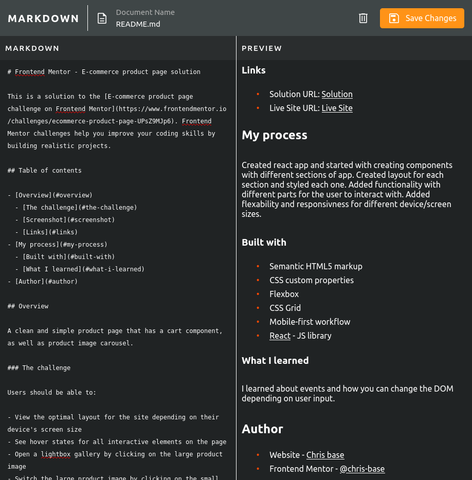

# Overview

This is a solution to the [In-browser markdown editor challenge on Frontend Mentor](https://www.frontendmentor.io/challenges/inbrowser-markdown-editor-r16TrrQX9). Frontend Mentor challenges help you improve your coding skills by building realistic projects.

### Screenshot

## Links

Live Site - [Live Site](https://chris-base.github.io/browser-markdown-editor/)
GitHub - [Chris base](https://github.com/chris-base)
